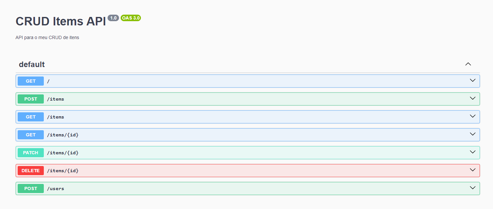

# Projeto API de Gestão de Itens

Este projeto é uma aplicação **NestJS** para gestão de itens, utilizando o **Prisma ORM** com **PostgreSQL**.

## Pré-requisitos

- Node.js (v20.x ou superior)
- npm ou yarn
- PostgreSQL

### Prisma CLI

```bash
$ npm install prisma --save-dev

$ npx prisma generate
```

### Prisma studio

```bash
$ npx prisma migrate dev


$ npx prisma studio

```

## Swagger

http://localhost:3000/api



## Postman

O arquivo JSON com a collection do postman se encontra junto ao código.

## Project setup

```bash
$ npm install
```

## Compile and run the project

```bash
# watch mode
$ npm run start:dev
```

## License

Nest is [MIT licensed](https://github.com/nestjs/nest/blob/master/LICENSE).
